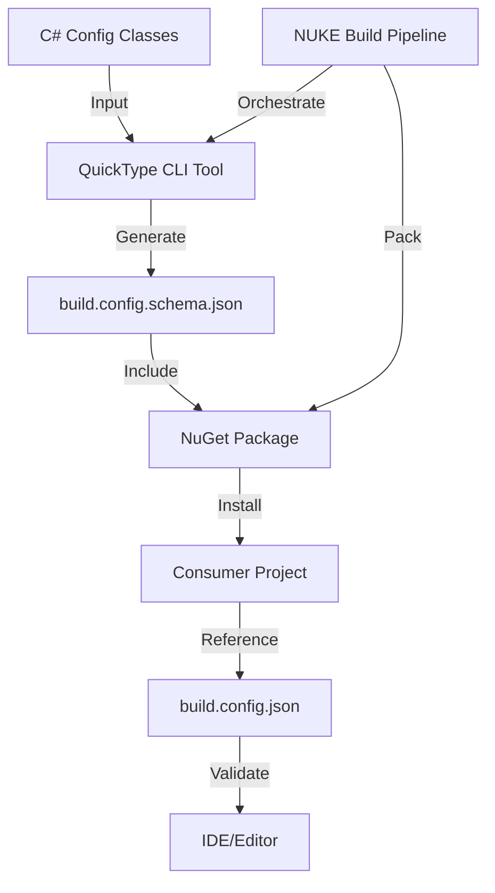

# Design Document: Automated JSON Schema Generation

## Overview

This feature adds automated JSON schema generation to UnifyBuild using QuickType, enabling IDE autocomplete and validation for `build.config.json` files in consumer projects. The schema is generated from C# classes during the build process, packaged with the NuGet package, and automatically referenced by consumers. This eliminates manual schema maintenance and ensures the schema always matches the C# configuration classes.

## Architecture

The solution integrates QuickType as a .NET tool into the NUKE build pipeline, generates the schema during the Pack target, includes it in the NuGet package as a content file, and provides automatic `$schema` reference resolution for consumers.



## Main Workflow

```mermaid
sequenceDiagram
    participant Dev as Developer
    participant Build as NUKE Build
    participant QT as QuickType
    participant NuGet as NuGet Package
    participant Consumer as Consumer Project
    participant IDE as IDE/Editor

    Dev->>Build: Run Pack target
    Build->>QT: Execute quicktype CLI
    QT->>QT: Parse BuildConfigJson.cs
    QT->>Build: Generate schema.json
    Build->>NuGet: Include schema in package
    Dev->>Consumer: Install/Update package
    Consumer->>Consumer: Copy schema to project
    Consumer->>IDE: Open build.config.json
    IDE->>IDE: Load schema reference
    IDE->>Dev: Provide autocomplete/validation


## Components and Interfaces

### Component 1: QuickType Integration

**Purpose**: Integrate QuickType as a .NET tool to generate JSON schema from C# classes

**Interface**:
```csharp
// NUKE target extension
interface IUnifySchemaGeneration
{
    Target GenerateSchema => _ => _
        .Description("Generate JSON schema from C# configuration classes")
        .Executes(() => { /* implementation */ });
}
```

**Responsibilities**:
- Install QuickType as a .NET local tool
- Execute QuickType CLI with appropriate parameters
- Generate schema from BuildConfigJson.cs and related classes
- Place schema in appropriate output directory

### Component 2: Schema Generation Target

**Purpose**: NUKE build target that orchestrates schema generation

**Interface**:
```csharp
Target GenerateSchema => _ => _
    .Description("Generate JSON schema from BuildConfigJson.cs")
    .Before(Pack)
    .Executes(() =>
    {
        // Install quicktype if not present
        DotNetToolInstall(s => s
            .SetPackageName("quicktype")
            .SetLocal(true));
        
        // Generate schema
        QuickTypeGenerate(
            inputFile: SourceDirectory / "UnifyBuild.Nuke" / "BuildConfigJson.cs",
            outputFile: ArtifactsDirectory / "build.config.schema.json",
            language: "schema",
            topLevel: "BuildJsonConfig");
    });
```

**Responsibilities**:
- Ensure QuickType tool is available
- Execute schema generation before Pack target
- Handle errors and provide clear diagnostics
- Validate generated schema output

### Component 3: NuGet Package Content

**Purpose**: Include schema file in NuGet package for consumer access

**MSBuild Configuration**:
```xml
<ItemGroup>
  <None Include="$(ArtifactsDir)/build.config.schema.json" 
        Pack="true" 
        PackagePath="contentFiles/any/any;content" 
        CopyToOutputDirectory="PreserveNewest" />
</ItemGroup>
```

**Responsibilities**:
- Package schema file in NuGet package
- Ensure schema is copied to consumer project root
- Support both SDK-style and legacy project formats

### Component 4: Schema Reference Mechanism

**Purpose**: Enable automatic schema reference in consumer projects

**Approach**: Consumers manually add `$schema` reference to their `build.config.json`:
```json
{
  "$schema": "./build.config.schema.json",
  "versionEnv": "GITVERSION_MAJORMINORPATCH",
  ...
}
```

**Responsibilities**:
- Document schema reference pattern in README
- Provide example configuration files
- Support relative path resolution

## Data Models

### QuickType Configuration

```csharp
public sealed class QuickTypeSettings
{
    /// <summary>
    /// Input C# source file containing configuration classes
    /// </summary>
    public string InputFile { get; set; }
    
    /// <summary>
    /// Output JSON schema file path
    /// </summary>
    public string OutputFile { get; set; }
    
    /// <summary>
    /// Target language (always "schema" for JSON Schema)
    /// </summary>
    public string Language { get; set; } = "schema";
    
    /// <summary>
    /// Top-level type name to generate schema for
    /// </summary>
    public string TopLevel { get; set; } = "BuildJsonConfig";
    
    /// <summary>
    /// Additional QuickType options
    /// </summary>
    public Dictionary<string, string> Options { get; set; }
}
```

**Validation Rules**:
- InputFile must exist and be a valid C# file
- OutputFile must be a writable path
- TopLevel must match a class name in InputFile

### Schema Package Metadata

```csharp
public sealed class SchemaPackageInfo
{
    /// <summary>
    /// Schema file name in package
    /// </summary>
    public string SchemaFileName { get; set; } = "build.config.schema.json";
    
    /// <summary>
    /// Package path for schema file
    /// </summary>
    public string PackagePath { get; set; } = "contentFiles/any/any;content";
    
    /// <summary>
    /// Whether to copy schema to output directory
    /// </summary>
    public bool CopyToOutput { get; set; } = true;
}
```

## Algorithmic Pseudocode

### Schema Generation Algorithm

```pascal
ALGORITHM GenerateJsonSchema
INPUT: sourceFile (path to BuildConfigJson.cs)
OUTPUT: schemaFile (path to build.config.schema.json)

BEGIN
  // Step 1: Ensure QuickType tool is installed
  IF NOT IsToolInstalled("quicktype") THEN
    EXECUTE DotNetToolInstall("quicktype", local: true)
  END IF
  
  // Step 2: Validate input file exists
  ASSERT FileExists(sourceFile)
  
  // Step 3: Create output directory if needed
  outputDir ← GetDirectoryName(schemaFile)
  IF NOT DirectoryExists(outputDir) THEN
    CreateDirectory(outputDir)
  END IF
  
  // Step 4: Execute QuickType CLI
  args ← BuildQuickTypeArguments(sourceFile, schemaFile)
  result ← ExecuteProcess("quicktype", args)
  
  // Step 5: Validate generation succeeded
  IF result.ExitCode ≠ 0 THEN
    THROW SchemaGenerationException(result.ErrorOutput)
  END IF
  
  ASSERT FileExists(schemaFile)
  
  // Step 6: Validate generated schema is valid JSON
  schemaContent ← ReadFile(schemaFile)
  ValidateJsonSchema(schemaContent)
  
  RETURN schemaFile
END
```

**Preconditions**:
- sourceFile exists and contains valid C# code
- BuildConfigJson class is defined in sourceFile
- .NET SDK is installed and available
- Write permissions for output directory

**Postconditions**:
- schemaFile exists and contains valid JSON Schema
- Schema accurately represents BuildConfigJson structure
- Schema includes all nested types (ProjectGroup, NativeBuildConfig, etc.)

**Loop Invariants**: N/A (no loops in main algorithm)

### Package Schema Inclusion Algorithm

```pascal
ALGORITHM IncludeSchemaInPackage
INPUT: schemaFile (generated schema path), packageSpec (NuGet package specification)
OUTPUT: updatedPackageSpec (package with schema included)

BEGIN
  // Step 1: Validate schema file exists
  ASSERT FileExists(schemaFile)
  
  // Step 2: Add schema to package content
  contentItem ← CreatePackageContentItem(
    sourcePath: schemaFile,
    packagePath: "contentFiles/any/any;content",
    copyToOutput: true
  )
  
  packageSpec.ContentFiles.Add(contentItem)
  
  // Step 3: Configure MSBuild properties for content files
  packageSpec.BuildProps.Add(
    "EnableDefaultContentItems", "true"
  )
  
  // Step 4: Validate package specification
  ValidatePackageSpec(packageSpec)
  
  RETURN packageSpec
END
```

**Preconditions**:
- schemaFile is a valid JSON Schema file
- packageSpec is a valid NuGet package specification
- Package build system supports contentFiles

**Postconditions**:
- Schema file is included in package
- Schema will be copied to consumer project root on install
- Package metadata is valid and buildable

**Loop Invariants**: N/A

### Consumer Schema Resolution Algorithm

```pascal
ALGORITHM ResolveSchemaReference
INPUT: configFile (path to build.config.json)
OUTPUT: schemaPath (resolved schema file path)

BEGIN
  // Step 1: Read config file
  configContent ← ReadFile(configFile)
  configJson ← ParseJson(configContent)
  
  // Step 2: Check for $schema property
  IF configJson.HasProperty("$schema") THEN
    schemaRef ← configJson["$schema"]
    
    // Step 3: Resolve relative path
    configDir ← GetDirectoryName(configFile)
    schemaPath ← ResolvePath(configDir, schemaRef)
    
    // Step 4: Validate schema file exists
    IF FileExists(schemaPath) THEN
      RETURN schemaPath
    ELSE
      WARN "Schema file not found: " + schemaPath
      RETURN null
    END IF
  ELSE
    // No schema reference
    RETURN null
  END IF
END
```

**Preconditions**:
- configFile exists and contains valid JSON
- File system supports relative path resolution

**Postconditions**:
- Returns valid schema path if reference exists and file is found
- Returns null if no reference or file not found
- No modifications to config file

**Loop Invariants**: N/A

## Key Functions with Formal Specifications

### Function 1: InstallQuickTypeTool()

```csharp
Target InstallQuickTypeTool => _ => _
    .Description("Install QuickType as a local .NET tool")
    .OnlyWhenDynamic(() => !IsQuickTypeInstalled())
    .Executes(() =>
    {
        DotNetToolInstall(s => s
            .SetPackageName("quicktype")
            .SetLocal(true)
            .SetToolManifestPath(RootDirectory / ".config" / "dotnet-tools.json"));
    });
```

**Preconditions**:
- .NET SDK is installed and available in PATH
- .config directory exists or can be created
- Network access for NuGet package download

**Postconditions**:
- QuickType tool is installed locally
- Tool manifest file (.config/dotnet-tools.json) is created/updated
- QuickType is available via `dotnet quicktype` command

**Loop Invariants**: N/A

### Function 2: GenerateSchemaFromCSharp()

```csharp
void GenerateSchemaFromCSharp(
    AbsolutePath sourceFile,
    AbsolutePath outputFile,
    string topLevelType = "BuildJsonConfig")
{
    // Validate inputs
    Assert.FileExists(sourceFile);
    Assert.True(sourceFile.ToString().EndsWith(".cs"));
    
    // Ensure output directory exists
    outputFile.Parent.CreateDirectory();
    
    // Build QuickType arguments
    var args = new[]
    {
        "--src", sourceFile,
        "--out", outputFile,
        "--lang", "schema",
        "--top-level", topLevelType,
        "--just-types"
    };
    
    // Execute QuickType
    var result = ProcessTasks.StartProcess(
        "dotnet",
        $"quicktype {string.Join(" ", args)}",
        RootDirectory
    ).AssertZeroExitCode();
    
    // Validate output
    Assert.FileExists(outputFile);
    var schemaContent = File.ReadAllText(outputFile);
    Assert.True(IsValidJson(schemaContent));
}
```

**Preconditions**:
- sourceFile exists and is a valid C# file
- sourceFile contains a class named topLevelType
- QuickType tool is installed
- Write permissions for outputFile directory

**Postconditions**:
- outputFile exists and contains valid JSON Schema
- Schema represents the structure of topLevelType
- Schema includes all nested types referenced by topLevelType
- Process exits with code 0 (success)

**Loop Invariants**: N/A

### Function 3: ValidateGeneratedSchema()

```csharp
bool ValidateGeneratedSchema(AbsolutePath schemaFile)
{
    // Read schema content
    var schemaContent = File.ReadAllText(schemaFile);
    
    // Parse as JSON
    JsonDocument schema;
    try
    {
        schema = JsonDocument.Parse(schemaContent);
    }
    catch (JsonException ex)
    {
        Log.Error($"Invalid JSON in schema file: {ex.Message}");
        return false;
    }
    
    // Validate required properties
    var root = schema.RootElement;
    if (!root.TryGetProperty("$schema", out _))
    {
        Log.Warning("Schema missing $schema property");
    }
    
    if (!root.TryGetProperty("type", out var typeProperty) || 
        typeProperty.GetString() != "object")
    {
        Log.Error("Schema root must be of type 'object'");
        return false;
    }
    
    if (!root.TryGetProperty("properties", out _))
    {
        Log.Error("Schema missing properties definition");
        return false;
    }
    
    return true;
}
```

**Preconditions**:
- schemaFile exists and is readable
- File contains text content

**Postconditions**:
- Returns true if schema is valid JSON Schema format
- Returns false if schema is invalid
- Logs appropriate error/warning messages
- No modifications to schema file

**Loop Invariants**: N/A

## Example Usage

### Build Pipeline Integration

```csharp
// In UnifyBuildBase.cs or new IUnifySchema interface
class Build : NukeBuild, IUnify, IUnifySchema
{
    Target GenerateSchema => _ => _
        .Description("Generate JSON schema from BuildConfigJson.cs")
        .DependsOn(InstallQuickTypeTool)
        .Before(Pack)
        .Executes(() =>
        {
            var sourceFile = SourceDirectory / "UnifyBuild.Nuke" / "BuildConfigJson.cs";
            var outputFile = ArtifactsDirectory / "build.config.schema.json";
            
            GenerateSchemaFromCSharp(sourceFile, outputFile, "BuildJsonConfig");
            
            Log.Information($"Generated schema: {outputFile}");
        });
    
    Target Pack => _ => _
        .DependsOn(GenerateSchema)
        .Executes(() =>
        {
            // Pack will include schema via MSBuild configuration
            DotNetPack(/* ... */);
        });
}
```

### MSBuild Project Configuration

```xml
<!-- In UnifyBuild.Nuke.csproj -->
<Project Sdk="Microsoft.NET.Sdk">
  <PropertyGroup>
    <TargetFramework>net8.0</TargetFramework>
    <GeneratePackageOnBuild>true</GeneratePackageOnBuild>
  </PropertyGroup>
  
  <!-- Include generated schema in package -->
  <ItemGroup>
    <None Include="$(ArtifactsDir)/build.config.schema.json" 
          Condition="Exists('$(ArtifactsDir)/build.config.schema.json')"
          Pack="true" 
          PackagePath="contentFiles/any/any;content" 
          CopyToOutputDirectory="PreserveNewest" />
  </ItemGroup>
</Project>
```

### Consumer Usage

```json
// Consumer's build.config.json
{
  "$schema": "./build.config.schema.json",
  "versionEnv": "GITVERSION_MAJORMINORPATCH",
  "artifactsVersion": "1.0.0",
  "projectGroups": {
    "packages": {
      "sourceDir": "src",
      "action": "pack",
      "include": ["MyProject"]
    }
  }
}
```

## Correctness Properties

*A property is a characteristic or behavior that should hold true across all valid executions of a system—essentially, a formal statement about what the system should do. Properties serve as the bridge between human-readable specifications and machine-verifiable correctness guarantees.*

### Property 1: Tool Installation Idempotence

*For any* build execution, after the tool installation target runs, QuickType_Tool is available for use, regardless of whether it was previously installed.

**Validates: Requirements 1.1, 1.4**

### Property 2: Schema Completeness

*For any* public property in BuildJsonConfig or its nested types (ProjectGroup, NativeBuildConfig, UnityBuildJsonConfig, UnityPackageMappingConfig), the generated schema includes a definition for that property.

**Validates: Requirements 2.1, 2.4**

### Property 3: Schema Generation Success

*For any* valid C# source file containing BuildJsonConfig, executing the Schema_Generator produces a valid JSON Schema file at the specified output path.

**Validates: Requirements 2.2**

### Property 4: Type Mapping Accuracy

*For any* C# property type (string, bool, int, long, Dictionary, Array, List, nullable), the generated schema correctly maps it to the corresponding JSON Schema type according to standard type mapping rules.

**Validates: Requirements 3.1, 3.2, 3.3, 3.4, 3.5, 3.6**

### Property 5: Schema Structural Validity

*For any* generated schema file, it is valid JSON with a root element of type "object" and contains a "properties" definition.

**Validates: Requirements 4.1, 4.2, 4.3**

### Property 6: Package Content Inclusion

*For any* NuGet package built with the GenerateSchema target, the schema file is included in the contentFiles directory with CopyToOutputDirectory configured.

**Validates: Requirements 6.1, 6.2**

### Property 7: Consumer File Deployment

*For any* consumer project that installs the UnifyBuild.Nuke package, the schema file named "build.config.schema.json" is copied to the project root directory.

**Validates: Requirements 7.1, 7.2**

### Property 8: Package Update Synchronization

*For any* consumer project with an installed package, updating to a new package version replaces the schema file with the version from the new package.

**Validates: Requirements 7.3**

### Property 9: Configuration Validation Correctness

*For any* valid build.config.json file that conforms to BuildJsonConfig structure, validating it against the generated schema produces no validation errors.

**Validates: Requirements 10.4**

### Property 10: Schema Synchronization with Source

*For any* modification to BuildJsonConfig.cs (adding, removing, or changing property types), regenerating the schema produces output that accurately reflects the current class structure.

**Validates: Requirements 11.1, 11.2, 11.3, 11.4**

### Property 11: Tool Manifest Creation

*For any* successful QuickType_Tool installation, the Tool_Manifest file exists in the .config directory and contains an entry for quicktype.

**Validates: Requirements 1.2**

## Error Handling

### Error Scenario 1: QuickType Installation Failure

**Condition**: Network unavailable or NuGet package source inaccessible
**Response**: 
- Log clear error message indicating QuickType installation failed
- Provide manual installation instructions
- Fail build with actionable error message

**Recovery**: 
- User can manually install QuickType: `dotnet tool install quicktype --local`
- Retry build after network connectivity restored

### Error Scenario 2: Schema Generation Failure

**Condition**: QuickType fails to parse C# source file or generate schema
**Response**:
- Capture QuickType error output
- Log detailed error message with file path and line number if available
- Fail build with clear indication of what went wrong

**Recovery**:
- Check BuildConfigJson.cs for syntax errors
- Ensure all referenced types are in the same file or properly imported
- Verify QuickType version compatibility

### Error Scenario 3: Invalid Generated Schema

**Condition**: Generated schema is not valid JSON or JSON Schema
**Response**:
- Validate schema after generation
- Log validation errors with specific issues found
- Fail build to prevent packaging invalid schema

**Recovery**:
- Review QuickType output for issues
- Check for QuickType bugs or version incompatibilities
- Consider manual schema corrections as temporary workaround

### Error Scenario 4: Schema Not Found in Consumer Project

**Condition**: Consumer installs package but schema file is not copied
**Response**:
- Document troubleshooting steps in README
- Provide manual schema download instructions
- Log warning if schema reference exists but file not found

**Recovery**:
- Manually copy schema from package cache to project root
- Verify package installation completed successfully
- Check project SDK version compatibility with contentFiles

### Error Scenario 5: Schema Reference Resolution Failure

**Condition**: IDE cannot resolve $schema reference in build.config.json
**Response**:
- Document correct $schema reference format
- Provide examples of relative path resolution
- Suggest IDE-specific configuration if needed

**Recovery**:
- Verify schema file exists at referenced path
- Use absolute path or correct relative path
- Restart IDE to refresh schema cache

## Testing Strategy

### Unit Testing Approach

Test individual components in isolation:

1. **QuickType Tool Installation**
   - Test tool installation succeeds
   - Test tool is available after installation
   - Test idempotent installation (skip if already installed)

2. **Schema Generation**
   - Test schema generation from valid C# file
   - Test schema includes all properties from BuildJsonConfig
   - Test schema includes nested types (ProjectGroup, etc.)
   - Test schema generation fails gracefully with invalid input

3. **Schema Validation**
   - Test generated schema is valid JSON
   - Test generated schema conforms to JSON Schema specification
   - Test schema type mappings are correct

4. **Package Content**
   - Test schema file is included in NuGet package
   - Test schema file is in correct package path
   - Test package metadata is valid

### Property-Based Testing Approach

**Property Test Library**: fast-check (if using TypeScript/JavaScript) or FsCheck (if using F#/C#)

**Property Tests**:

1. **Schema Completeness Property**
   - Generate random C# class structures
   - Generate schema from each class
   - Verify all properties are present in schema

2. **Type Mapping Property**
   - Generate random C# property types
   - Generate schema for each type
   - Verify JSON Schema type matches C# type

3. **Roundtrip Property**
   - Generate random valid build.config.json
   - Validate against generated schema
   - Verify validation succeeds for all valid configs

### Integration Testing Approach

Test end-to-end workflow:

1. **Build Pipeline Integration**
   - Run full build with GenerateSchema target
   - Verify schema is generated before Pack
   - Verify schema is included in package
   - Verify package can be installed

2. **Consumer Project Integration**
   - Create test consumer project
   - Install UnifyBuild.Nuke package
   - Verify schema file is copied to project
   - Verify IDE provides autocomplete (manual verification)

3. **Schema Validation Integration**
   - Create valid and invalid build.config.json files
   - Validate against generated schema
   - Verify validation results are correct

## Performance Considerations

### Schema Generation Performance

- QuickType execution time: typically < 5 seconds for BuildConfigJson.cs
- Impact on build time: minimal (< 10 seconds total including tool installation)
- Caching: QuickType tool installation is cached after first run

### Package Size Impact

- Schema file size: approximately 5-10 KB
- Negligible impact on NuGet package size (< 0.1% increase)

### Consumer Impact

- Schema file copy: one-time operation during package installation
- IDE schema loading: typically < 1 second
- No runtime performance impact (schema used only for IDE features)

## Security Considerations

### Schema Generation Security

- QuickType runs as local .NET tool (not global)
- No external network calls during schema generation
- Input validation: only process known C# source files

### Package Distribution Security

- Schema file is static content (no executable code)
- Standard NuGet package signing applies
- No additional security risks introduced

### Consumer Security

- Schema file is read-only content
- No code execution in consumer projects
- Standard JSON Schema validation (no script execution)

## Dependencies

### Build-Time Dependencies

1. **QuickType** (>= 23.0.0)
   - .NET tool for generating JSON Schema from C# classes
   - Installed via: `dotnet tool install quicktype --local`
   - License: Apache 2.0

2. **NUKE.Common** (>= 8.0.0)
   - Already a dependency of UnifyBuild.Nuke
   - Used for build orchestration

3. **.NET SDK** (>= 8.0)
   - Required for running .NET tools
   - Already required by UnifyBuild

### Runtime Dependencies

None - schema generation is build-time only

### Consumer Dependencies

None - schema file is static content, no additional dependencies for consumers

## Implementation Phases

### Phase 1: QuickType Integration
- Add QuickType as .NET tool dependency
- Create tool manifest (.config/dotnet-tools.json)
- Implement InstallQuickTypeTool target

### Phase 2: Schema Generation Target
- Implement GenerateSchema target in NUKE build
- Add schema validation logic
- Integrate with existing Pack target

### Phase 3: Package Configuration
- Update UnifyBuild.Nuke.csproj to include schema
- Configure contentFiles packaging
- Test package contents

### Phase 4: Documentation & Examples
- Update README with schema usage instructions
- Add example build.config.json with $schema reference
- Document troubleshooting steps

### Phase 5: Testing & Validation
- Implement unit tests for schema generation
- Create integration tests with test consumer project
- Validate IDE autocomplete functionality

## Alternative Approaches Considered

### Alternative 1: NJsonSchema Instead of QuickType

**Pros**:
- Native C# library (no external tool)
- Direct integration with .NET code
- More control over schema generation

**Cons**:
- Requires code changes to add schema generation logic
- More complex implementation
- Less mature than QuickType for C#-to-schema conversion

**Decision**: Use QuickType for simplicity and maturity

### Alternative 2: Manual Schema Maintenance

**Pros**:
- Full control over schema structure
- Can add custom validation rules
- No build-time dependencies

**Cons**:
- Manual maintenance burden
- Schema can drift from C# classes
- Error-prone

**Decision**: Automate with QuickType to eliminate manual maintenance

### Alternative 3: Embedded Resource Instead of Content File

**Pros**:
- Schema embedded in assembly
- No separate file to manage

**Cons**:
- Consumers cannot easily access schema file
- IDE cannot reference embedded resources
- More complex extraction logic needed

**Decision**: Use content file for IDE accessibility

### Alternative 4: Runtime Schema Validation

**Pros**:
- Catch configuration errors at runtime
- Provide detailed validation messages

**Cons**:
- Adds runtime dependency
- Performance overhead
- Validation already happens at deserialization

**Decision**: Focus on IDE-time validation, defer runtime validation to future enhancement
