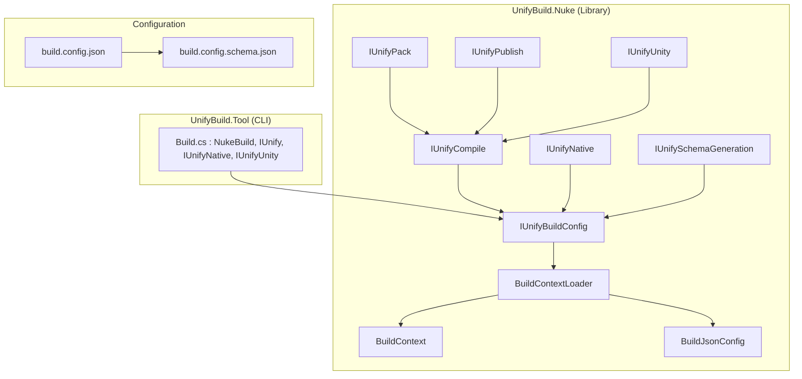
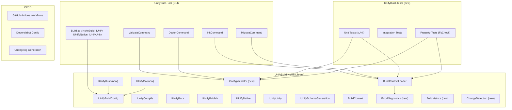

# Design Document: UnifyBuild Project Enhancements 2026

## Overview

This design covers 22 requirements for the UnifyBuild .NET build orchestration system, organized into 6 implementation phases. The system is built on NUKE with composable component interfaces (`IUnifyCompile`, `IUnifyPack`, `IUnifyPublish`, `IUnifyNative`, `IUnifyUnity`) and JSON schema-driven configuration (`build.config.json`).

The enhancements span CI/CD automation, CLI tooling (init/validate/doctor/migrate commands), error handling, testing infrastructure, native build expansion (Rust, Go), security scanning, performance optimization, observability, extensibility, documentation, and backward compatibility.

### Design Principles

1. **Backward Compatibility First** — All changes maintain compatibility with existing `BuildJsonConfig` schema and component interfaces. Breaking changes only in major versions with automated migration.
2. **Composable Architecture** — New features follow the existing `IUnify*` component interface pattern, keeping concerns separated.
3. **Configuration-Driven** — New capabilities are enabled/disabled via `build.config.json` extensions, validated by JSON Schema.
4. **Dogfooding** — UnifyBuild continues to build itself, validating all enhancements end-to-end.

### Priority Focus

- **P0 (Critical)**: Requirements 1, 2, 3, 5, 22 — Full detailed design
- **P1 (High)**: Requirements 4, 6, 7, 8, 11, 12, 15 — Detailed design
- **P2 (Nice-to-have)**: Requirements 9, 10, 13, 14, 16, 17, 18, 19, 20, 21 — Lighter design with extension points

## Architecture

### Current Architecture



### Enhanced Architecture



### New Project Structure

```
dotnet/
├── src/
│   ├── UnifyBuild.Nuke/           # Core library (existing)
│   │   ├── Commands/              # New: CLI command implementations
│   │   │   ├── InitCommand.cs
│   │   │   ├── ValidateCommand.cs
│   │   │   ├── DoctorCommand.cs
│   │   │   └── MigrateCommand.cs
│   │   ├── Diagnostics/           # New: Error handling & diagnostics
│   │   │   ├── ErrorDiagnostics.cs
│   │   │   ├── ErrorCode.cs
│   │   │   └── DiagnosticMessage.cs
│   │   ├── Validation/            # New: Config validation
│   │   │   ├── ConfigValidator.cs
│   │   │   └── ValidationResult.cs
│   │   ├── Performance/           # New: Build performance
│   │   │   ├── ChangeDetection.cs
│   │   │   ├── BuildCache.cs
│   │   │   └── BuildMetrics.cs
│   │   ├── IUnifyRust.cs          # New: Rust/Cargo builds
│   │   ├── IUnifyGo.cs            # New: Go builds
│   │   └── ... (existing files)
│   └── UnifyBuild.Tool/           # CLI tool (existing)
│       └── Build.cs               # Enhanced with new commands
├── tests/
│   ├── UnifyBuild.Nuke.Tests/     # New: Unit + property tests
│   └── UnifyBuild.Integration.Tests/ # New: Integration tests
└── UnifyBuild.sln                 # Updated with test projects
```


## Components and Interfaces

### Requirement 1: Automated CI/CD Pipeline (P0)

**Design Decision**: Use GitHub Actions with reusable workflows. Three workflow files: `ci.yml` (PR validation), `cd.yml` (main branch builds), `release.yml` (tag-triggered release).

**Workflow: ci.yml (Pull Request)**
- Trigger: `pull_request` to `main`
- Matrix: `[windows-latest, ubuntu-latest, macos-latest]`
- Steps: restore → compile → test → validate schema → lint (dotnet format)
- Cache: `actions/cache` for NuGet packages (`~/.nuget/packages`)

**Workflow: cd.yml (Main Branch)**
- Trigger: `push` to `main`
- Steps: restore → full build via `dotnet unify-build PackProjects` (dogfooding)
- Validates the complete build pipeline end-to-end

**Workflow: release.yml (Version Tag)**
- Trigger: `push` tags matching `v*`
- Steps: GitVersion → build → pack → publish to NuGet.org → create GitHub Release → generate SBOM → attach changelog
- Uses `dotnet-sbom-tool` for SBOM generation (SPDX format)
- Uses `gitversion/setup@v1` for semantic versioning
- NuGet API key stored as GitHub secret `NUGET_API_KEY`

**GitVersion Integration**: Already configured via `GitVersion.yml` (Mainline mode, Patch increment on main). CI workflows use `GITVERSION_MAJORMINORPATCH` env var which `BuildContextLoader` already reads.

### Requirement 2: Comprehensive Documentation (P0)

**Design Decision**: Documentation lives in `docs/` directory with markdown files. README.md serves as the entry point with links to detailed guides.

**Documentation Structure**:
```
docs/
├── getting-started.md          # Installation + first build
├── configuration-reference.md  # All build.config.json properties
├── api-reference.md            # Component interfaces documentation
├── migration-guide.md          # v1 → v2 schema migration
├── architecture.md             # Component design explanation
├── troubleshooting.md          # Common errors and fixes
├── contributing.md             # Extending component interfaces
└── examples/
    ├── dotnet-library.md       # Library project example
    ├── dotnet-application.md   # Application project example
    ├── native-build.md         # CMake integration example
    └── unity-build.md          # Unity integration example
```

### Requirement 3: Init Command (P0)

**Design Decision**: Implement as a NUKE target `Init` in `Build.cs` that delegates to `InitCommand` class. Uses `Spectre.Console` for interactive prompts (already a common .NET CLI library).

```csharp
public sealed class InitCommand
{
    public record InitOptions(
        string OutputPath,
        bool Interactive,
        string? Template,  // "library" | "application" | null
        bool Force         // overwrite existing
    );

    public record InitResult(
        string ConfigPath,
        BuildJsonConfig GeneratedConfig,
        List<string> DiscoveredProjects
    );

    // Core logic: discover .csproj files, prompt for selection, generate config
    public InitResult Execute(AbsolutePath repoRoot, InitOptions options);

    // Project discovery: find all .csproj files, group by directory
    internal List<DiscoveredProject> DiscoverProjects(AbsolutePath repoRoot);

    // Template generation: create config from template name
    internal BuildJsonConfig GenerateFromTemplate(string template, List<DiscoveredProject> projects);

    // Config serialization: write config with $schema reference and comments
    internal string SerializeConfig(BuildJsonConfig config);
}
```

**Project Discovery Logic**:
1. Recursively find all `.csproj` files from repo root
2. Exclude `bin/`, `obj/`, `node_modules/`, `.git/` directories
3. Group by parent directory to suggest `ProjectGroup` entries
4. Detect output type from `.csproj` (`<OutputType>Exe</OutputType>` → publish, library → pack/compile)
5. Detect CMakeLists.txt for native build configuration
6. Detect Unity project structure for Unity build configuration

**Templates**:
- `library`: Single project group with `action: "pack"`, includes symbol packages
- `application`: Single project group with `action: "publish"`, includes solution reference

### Requirement 4: Validate and Doctor Commands (P1)

**Design Decision**: Two separate commands sharing a common `ConfigValidator` class.

```csharp
public sealed class ConfigValidator
{
    public record ValidationResult(
        bool IsValid,
        List<ValidationIssue> Issues
    );

    public record ValidationIssue(
        ValidationSeverity Severity,  // Error, Warning, Info
        string Code,                  // e.g., "UB001"
        string Message,
        string? FilePath,
        int? Line,
        string? Suggestion
    );

    // Schema validation using System.Text.Json + NJsonSchema
    public ValidationResult ValidateSchema(string configPath);

    // Semantic validation (project refs exist, dirs exist, no duplicates)
    public ValidationResult ValidateSemantic(AbsolutePath repoRoot, BuildJsonConfig config);
}

public sealed class DoctorCommand
{
    public record DoctorResult(
        List<DoctorCheck> Checks,
        int FixableCount,
        int FixedCount
    );

    public record DoctorCheck(
        string Name,
        DoctorStatus Status,  // Pass, Fail, Warning
        string Message,
        string? FixSuggestion,
        bool AutoFixable
    );

    // Checks: NUKE installed, dotnet SDK version, npm available, config valid,
    //         projects exist, source dirs exist, no duplicate refs, tool version
    public DoctorResult Execute(AbsolutePath repoRoot, bool autoFix);
}
```

### Requirement 5: Enhanced Error Handling (P0)

**Design Decision**: Introduce structured error codes and a `DiagnosticMessage` type used throughout the system. Wrap existing exception paths with contextual information.

```csharp
public enum ErrorCode
{
    // Config errors: UB1xx
    ConfigNotFound = 100,
    ConfigParseError = 101,
    ConfigSchemaViolation = 102,
    ConfigProjectNotFound = 103,
    ConfigDirNotFound = 104,
    ConfigDuplicateProject = 105,

    // Build errors: UB2xx
    BuildTargetFailed = 200,
    CompilationFailed = 201,
    NativeBuildFailed = 202,
    UnityBuildFailed = 203,

    // Tool errors: UB3xx
    ToolNotFound = 300,
    ToolVersionMismatch = 301,

    // Schema errors: UB4xx
    SchemaGenerationFailed = 400,
    SchemaValidationFailed = 401,
}

public sealed record DiagnosticMessage(
    ErrorCode Code,
    string Message,
    string? FilePath,
    int? Line,
    int? Column,
    string? Suggestion,
    string? DocsLink
);
```

**Integration Points**:
- `BuildContextLoader.FromJson()` — Wrap `JsonException` with line/column info, suggest docs link
- `DiscoverProjectsInGroup()` — Report missing source directories with full path
- `IUnifyNative.Native` — Capture CMake stderr, extract error context
- `IUnifyUnity.BuildForUnity` — Capture Unity build log, highlight errors
- All targets — Structured logging via Serilog with `[UBxxx]` error code prefix

**Verbose Mode**: Already supported by NUKE via `--verbosity` parameter. Enhance by logging all executed process commands in verbose mode.

### Requirement 6: Unit Test Coverage (P1)

**Design Decision**: New `UnifyBuild.Nuke.Tests` project using xUnit + FsCheck for property-based testing. Test project added to solution.

**Test Organization**:
```
dotnet/tests/UnifyBuild.Nuke.Tests/
├── BuildContextLoaderTests.cs     # Config loading, version resolution
├── ConfigParsingTests.cs          # JSON deserialization edge cases
├── ConfigValidatorTests.cs        # Schema + semantic validation
├── ProjectDiscoveryTests.cs       # DiscoverProjectsInGroup logic
├── InitCommandTests.cs            # Init command logic
├── MigrateCommandTests.cs         # Migration logic
├── ErrorDiagnosticsTests.cs       # Error formatting
├── Properties/                    # Property-based tests
│   ├── ConfigRoundTripProperties.cs
│   ├── ProjectDiscoveryProperties.cs
│   └── ValidationProperties.cs
└── Fixtures/                      # Shared test data
    ├── TestConfigFixtures.cs
    └── SampleConfigs/
```

**Framework**: xUnit (already used in consumer-test) + FsCheck.Xunit for property-based testing.

### Requirement 7: Integration and Performance Tests (P1)

**Design Decision**: Separate `UnifyBuild.Integration.Tests` project. Integration tests use temporary directories with real file system operations. Performance tests use `BenchmarkDotNet` for regression detection.

**Integration Test Approach**:
- Each test creates a temp directory with a minimal .NET project structure
- Tests invoke `BuildContextLoader.FromJson()` and validate the resulting `BuildContext`
- End-to-end tests invoke `dotnet build` / `dotnet pack` on real projects
- Cleanup via `IDisposable` pattern (already used in `EndToEndWorkflowTests`)

**Performance Benchmarks**:
- `ProjectDiscoveryBenchmark` — Measure `DiscoverProjectsInGroup` with varying repo sizes
- `ConfigParsingBenchmark` — Measure `BuildContextLoader.FromJson` with varying config complexity
- Baseline stored in `benchmarks/baseline.json`, CI compares against baseline

### Requirement 8: Expanded Native Build Support (P1)

**Design Decision**: Add `IUnifyRust` and `IUnifyGo` component interfaces following the same pattern as `IUnifyNative`. Extend `BuildJsonConfig` with `RustBuild` and `GoBuild` configuration sections.

```csharp
// New config sections in BuildJsonConfig
public sealed class RustBuildConfig
{
    public bool Enabled { get; set; } = true;
    public string? CargoManifestDir { get; set; }  // Directory containing Cargo.toml
    public string Profile { get; set; } = "release"; // debug | release | custom
    public string[]? Features { get; set; }
    public string? TargetTriple { get; set; }  // e.g., "x86_64-pc-windows-msvc"
    public string? OutputDir { get; set; }
    public string[]? ArtifactPatterns { get; set; }
}

public sealed class GoBuildConfig
{
    public bool Enabled { get; set; } = true;
    public string? GoModuleDir { get; set; }  // Directory containing go.mod
    public string[]? BuildFlags { get; set; }  // e.g., ["-ldflags", "-s -w"]
    public string? OutputBinary { get; set; }
    public string? OutputDir { get; set; }
    public Dictionary<string, string>? EnvVars { get; set; }  // GOOS, GOARCH, etc.
}
```

**Component Interfaces**:
```csharp
public interface IUnifyRust : IUnifyBuildConfig
{
    Target RustBuild => _ => _
        .Description("Build Rust projects via Cargo")
        .Executes(() => { /* detect cargo, execute cargo build */ });
}

public interface IUnifyGo : IUnifyBuildConfig
{
    Target GoBuild => _ => _
        .Description("Build Go projects")
        .Executes(() => { /* detect go, execute go build */ });
}
```

**Tool Detection Pattern** (shared across Native/Rust/Go):
1. Check if tool is in PATH (`which cmake` / `cargo --version` / `go version`)
2. If not found, check common install locations
3. Report clear error with install instructions if not found

### Requirement 11: Security Scanning (P1)

**Design Decision**: Dependabot configuration files + `dotnet list package --vulnerable` in CI.

**Files**:
- `.github/dependabot.yml` — NuGet + GitHub Actions dependency monitoring
- `SECURITY.md` — Already exists, enhance with vulnerability response process
- CI step: `dotnet list package --vulnerable --include-transitive` with failure on critical

### Requirement 12: Build Performance Optimization (P1)

**Design Decision**: Implement change detection via file timestamp comparison and optional build caching.

```csharp
public sealed class ChangeDetection
{
    // Compare source file timestamps against last build marker
    public bool HasChanges(AbsolutePath projectDir, AbsolutePath markerFile);

    // Create/update build marker after successful build
    public void UpdateMarker(AbsolutePath markerFile);
}

public sealed class BuildCache
{
    // Cache key: hash of (project file + source files + config)
    public string ComputeCacheKey(AbsolutePath projectPath, BuildContext config);

    // Local cache in build/_cache/
    public bool TryGetCached(string cacheKey, AbsolutePath outputDir);
    public void Store(string cacheKey, AbsolutePath outputDir);
}
```

**Parallelization**: NUKE already supports parallel target execution. Ensure independent project groups can build in parallel by avoiding shared state.

### Requirement 15: Automated Changelog Generation (P1)

**Design Decision**: Use `git-cliff` (Rust-based, fast) or `conventional-changelog` for generating changelogs from conventional commits.

**Commit Convention**: `type(scope): description` where type is `feat|fix|docs|chore|refactor|perf|test|ci`.

**CI Integration**:
- PR validation: Check commit message format via GitHub Action
- Release workflow: Generate changelog entries, update `CHANGELOG.md`, include in GitHub Release body

### Requirement 22: Backward Compatibility and Migration (P0)

**Design Decision**: Implement `MigrateCommand` that transforms old config formats to current schema. Deprecation warnings via Serilog when deprecated properties are detected.

```csharp
public sealed class MigrateCommand
{
    public record MigrateResult(
        string OriginalPath,
        string BackupPath,
        string MigratedPath,
        List<string> Changes,
        bool IsValid
    );

    // Detect config version, apply transformations, validate result
    public MigrateResult Execute(AbsolutePath configPath);

    // Create backup before migration
    internal string CreateBackup(string configPath);

    // Apply migration rules (v1 → v2, future v2 → v3)
    internal BuildJsonConfig ApplyMigrations(JsonDocument original, int fromVersion);
}
```

**Deprecation Strategy**:
- `UnifyBuildBase` already marked `[Obsolete]` — maintain for one more major version
- New deprecated properties logged with `Serilog.Log.Warning("[DEPRECATED] ...")` including migration guidance
- `BuildContextLoader` detects old property names and maps them with warnings

### P2 Requirements (Lighter Design)

**Requirement 9 (Unity Docs)**: Add `docs/examples/unity-build.md` with sample config and project structure. Add integration test using mock Unity project structure.

**Requirement 10 (Package Management)**: Extend `BuildJsonConfig` with `NuGetRegistries` array and `PackageSigning` config. Implement in `IUnifyPack` with multi-registry push loop.

**Requirement 13 (Extensibility)**: Document the component interface pattern in `docs/extensibility.md`. Provide Docker and Terraform sample components as separate example projects.

**Requirement 14 (Observability)**: Add `BuildMetrics` class that tracks target durations via `Stopwatch`. Export to JSON/CSV after build completion. Optional telemetry via opt-in config flag.

**Requirement 16 (Wizard)**: Enhanced version of init command using `Spectre.Console` multi-step wizard with real-time validation and config preview.

**Requirement 17 (Doc Site)**: Use `docfx` or `mkdocs` to generate static site from `docs/` markdown. Deploy via GitHub Pages in CI.

**Requirement 18 (VS Code Extension)**: TypeScript extension providing JSON Schema IntelliSense (already partially handled by `$schema` reference), tree view for project groups, and command palette integration.

**Requirement 19 (Community Examples)**: Separate `unify-build-examples` repository with CI validation. Template repos for common scenarios.

**Requirement 20 (Video Tutorials)**: Content plan with scripts. Not a code deliverable.

**Requirement 21 (Build Dashboard)**: Simple HTML/JS dashboard reading JSON metrics files. Optional Grafana integration for teams.

## Data Models

### Extended BuildJsonConfig

The existing `BuildJsonConfig` class is extended with new optional properties for Rust, Go, security, performance, and observability features:

```csharp
public sealed class BuildJsonConfig
{
    // ... existing properties unchanged ...

    // New: Rust build configuration (Req 8)
    public RustBuildConfig? RustBuild { get; set; }

    // New: Go build configuration (Req 8)
    public GoBuildConfig? GoBuild { get; set; }

    // New: Performance settings (Req 12)
    public PerformanceConfig? Performance { get; set; }

    // New: Observability settings (Req 14)
    public ObservabilityConfig? Observability { get; set; }

    // New: Package management settings (Req 10)
    public PackageManagementConfig? PackageManagement { get; set; }
}

public sealed class PerformanceConfig
{
    public bool IncrementalBuild { get; set; } = true;
    public bool EnableCache { get; set; } = false;
    public string? CacheDir { get; set; }  // Default: "build/_cache"
    public string? DistributedCacheUrl { get; set; }
}

public sealed class ObservabilityConfig
{
    public bool EnableMetrics { get; set; } = true;
    public string MetricsFormat { get; set; } = "json";  // "json" | "csv"
    public string? MetricsOutputDir { get; set; }
    public bool EnableTelemetry { get; set; } = false;  // Opt-in only
}

public sealed class PackageManagementConfig
{
    public NuGetRegistryConfig[]? Registries { get; set; }
    public PackageSigningConfig? Signing { get; set; }
    public SbomConfig? Sbom { get; set; }
    public RetentionPolicyConfig? Retention { get; set; }
}
```

### Extended BuildContext

```csharp
public sealed record BuildContext
{
    // ... existing properties unchanged ...

    // New: Rust build context (Req 8)
    public RustBuildContext? RustBuild { get; init; }

    // New: Go build context (Req 8)
    public GoBuildContext? GoBuild { get; init; }

    // New: Performance context (Req 12)
    public PerformanceContext? Performance { get; init; }
}
```

### Validation Models

```csharp
public sealed record ValidationResult(
    bool IsValid,
    IReadOnlyList<ValidationIssue> Issues
)
{
    public IEnumerable<ValidationIssue> Errors =>
        Issues.Where(i => i.Severity == ValidationSeverity.Error);
    public IEnumerable<ValidationIssue> Warnings =>
        Issues.Where(i => i.Severity == ValidationSeverity.Warning);
}

public sealed record ValidationIssue(
    ValidationSeverity Severity,
    string Code,
    string Message,
    string? FilePath = null,
    int? Line = null,
    string? Suggestion = null
);

public enum ValidationSeverity { Error, Warning, Info }
```

### JSON Schema Extensions

The `build.config.schema.json` is extended with new `$defs` for `rustBuild`, `goBuild`, `performance`, `observability`, and `packageManagement` sections. All new properties are optional to maintain backward compatibility.


## Correctness Properties

*A property is a characteristic or behavior that should hold true across all valid executions of a system — essentially, a formal statement about what the system should do. Properties serve as the bridge between human-readable specifications and machine-verifiable correctness guarantees.*

### Property 1: Init command generates valid configuration

*For any* set of discovered projects and selected build actions, the `InitCommand.Execute()` method should produce a `BuildJsonConfig` that (a) is written to disk at the expected path and (b) passes JSON Schema validation against `build.config.schema.json`.

**Validates: Requirements 3.1, 3.5**

### Property 2: Project discovery finds all .csproj files

*For any* directory tree containing `.csproj` files (excluding `bin/`, `obj/`, and hidden directories), the project discovery function should return every `.csproj` file in the tree, and no files from excluded directories.

**Validates: Requirements 3.2**

### Property 3: Schema validation correctly classifies configs

*For any* JSON string, `ConfigValidator.ValidateSchema()` should return `IsValid = true` if and only if the JSON conforms to the `build.config.schema.json` schema. Equivalently: for any valid `BuildJsonConfig` object, serializing it to JSON and validating should always pass.

**Validates: Requirements 4.1**

### Property 4: Reference validation reports all missing paths

*For any* `BuildJsonConfig` containing project group references, `ConfigValidator.ValidateSemantic()` should report a validation issue for every referenced source directory that does not exist on disk, and for every referenced project that cannot be found.

**Validates: Requirements 4.2, 4.3, 5.2**

### Property 5: Duplicate project detection

*For any* `BuildJsonConfig` where the same project name appears in multiple project groups or is listed more than once within a single group, `ConfigValidator.ValidateSemantic()` should report a duplicate project validation issue for each duplicate occurrence.

**Validates: Requirements 4.4**

### Property 6: Error messages include location information

*For any* malformed JSON input to `BuildContextLoader.FromJson()`, the resulting error message should contain both a line number and a column number extracted from the `JsonException`.

**Validates: Requirements 4.5, 5.1**

### Property 7: Doctor checks include fix suggestions

*For any* `DoctorCheck` with status `Fail` or `Warning`, the `FixSuggestion` property should be non-null and non-empty.

**Validates: Requirements 4.10**

### Property 8: Doctor auto-fix resolves fixable issues

*For any* auto-fixable issue detected by `DoctorCommand`, running `Execute(repoRoot, autoFix: true)` should result in the same check passing on a subsequent run of `Execute(repoRoot, autoFix: false)`.

**Validates: Requirements 4.11**

### Property 9: Diagnostic messages include error code and docs link

*For any* `DiagnosticMessage` produced by the error handling system, the `Code` field should be a valid `ErrorCode` enum value, and the `DocsLink` field should be a non-null, non-empty URL string.

**Validates: Requirements 5.6, 5.11, 5.12**

### Property 10: Vcpkg toolchain detection

*For any* repository root directory, if a file exists at `{repoRoot}/vcpkg/scripts/buildsystems/vcpkg.cmake`, then `TryDetectVcpkgToolchain()` should return that path. If the file does not exist, it should return null.

**Validates: Requirements 8.5**

### Property 11: Artifact collection copies matching files

*For any* build output directory and set of artifact patterns, `CollectArtifacts()` should copy exactly the files matching the patterns to the output directory, and no other files.

**Validates: Requirements 8.12**

### Property 12: Change detection reflects file timestamps

*For any* project directory with a build marker file, `ChangeDetection.HasChanges()` should return `true` if and only if at least one source file in the directory has a last-write timestamp newer than the marker file's timestamp.

**Validates: Requirements 12.2, 12.3**

### Property 13: Build cache round trip

*For any* set of build output files, storing them in the cache via `BuildCache.Store()` and then retrieving via `BuildCache.TryGetCached()` with the same cache key should produce files with identical content.

**Validates: Requirements 12.5**

### Property 14: Metrics invariants

*For any* completed build execution, the `BuildMetrics` report should satisfy: (a) total duration >= 0, (b) each target duration >= 0, (c) sum of target durations <= total duration, (d) cache hits + cache misses = total cache lookups.

**Validates: Requirements 14.1, 14.2, 14.3, 14.5**

### Property 15: Metrics serialization round trip

*For any* `BuildMetrics` object, serializing to JSON and deserializing back should produce an equivalent object. Similarly for CSV export: exporting and re-importing should preserve all numeric values and labels.

**Validates: Requirements 14.6, 14.7**

### Property 16: Deprecation warnings include migration guidance

*For any* `BuildJsonConfig` containing a deprecated property (e.g., v1-style properties), loading the config via `BuildContextLoader.FromJson()` should produce at least one log warning containing both the deprecated property name and a migration instruction string.

**Validates: Requirements 22.3, 22.4**

### Property 17: Migration produces valid config with backup

*For any* valid old-format `BuildJsonConfig`, executing `MigrateCommand.Execute()` should: (a) create a backup file at `{originalPath}.bak`, (b) produce a migrated config that passes `ConfigValidator.ValidateSchema()`, and (c) preserve all project references from the original config.

**Validates: Requirements 22.8, 22.9, 22.10**

## Error Handling

### Error Code System

All errors use structured `DiagnosticMessage` objects with categorized error codes:

| Range | Category | Examples |
|-------|----------|----------|
| UB1xx | Configuration | Config not found, parse error, schema violation, missing project/dir |
| UB2xx | Build | Target failed, compilation error, native build error, Unity build error |
| UB3xx | Tooling | Tool not found, version mismatch |
| UB4xx | Schema | Schema generation failed, schema validation failed |

### Error Handling Strategy by Component

**BuildContextLoader**: Catches `JsonException` and wraps with line/column info + `UB101` code. Catches `FileNotFoundException` and wraps with searched paths + `UB100` code. All errors include a docs link to `docs/troubleshooting.md`.

**ConfigValidator**: Returns `ValidationResult` with accumulated issues rather than throwing. Each issue has severity, code, message, file path, line number, and suggestion.

**IUnifyNative / IUnifyRust / IUnifyGo**: Capture process stderr, extract relevant error lines, wrap in `DiagnosticMessage` with `UB202` code. Include the full command that was executed for reproducibility.

**IUnifyUnity**: Capture Unity build log, scan for `error` and `warning` prefixes, wrap in `DiagnosticMessage` with `UB203` code.

**InitCommand / MigrateCommand**: Validate inputs before execution. Return result objects with success/failure status rather than throwing for expected failure cases (e.g., config already exists).

### Verbose Mode

When `--verbosity verbose` is passed (NUKE built-in):
- Log all process invocations with full command line
- Log file system operations (create, copy, delete)
- Log config resolution steps (version source, path resolution)
- Log project discovery results

### Graceful Degradation

- Missing optional tools (CMake, Cargo, Go) → Skip with warning, don't fail build
- Missing optional config sections → Use defaults, log at Debug level
- Network failures (distributed cache, NuGet publish) → Retry with backoff, fail with clear message

## Testing Strategy

### Dual Testing Approach

The testing strategy uses both unit tests and property-based tests:

- **Unit tests** (xUnit): Verify specific examples, edge cases, error conditions, and integration points
- **Property tests** (FsCheck + xUnit): Verify universal properties across randomly generated inputs

### Test Framework

- **Unit/Integration**: xUnit (already used in `dotnet/samples/consumer-test/`)
- **Property-Based**: FsCheck.Xunit — mature .NET PBT library with xUnit integration
- **Mocking**: NSubstitute for interface mocking where needed
- **Assertions**: xUnit built-in + FluentAssertions for readable assertions

### Property-Based Testing Configuration

- Each property test runs a minimum of **100 iterations**
- Each property test is tagged with a comment referencing the design property:
  ```csharp
  // Feature: project-enhancements-2026, Property 1: Init command generates valid configuration
  [Property(MaxTest = 100)]
  public Property InitCommand_GeneratesValidConfig(ValidInitInputs inputs) => ...
  ```
- FsCheck generators are defined for:
  - `BuildJsonConfig` (valid configs with random project groups, actions, paths)
  - `ProjectGroup` (random source dirs, actions, include/exclude lists)
  - `ValidationIssue` (random severity, codes, messages)
  - `DiagnosticMessage` (random error codes with associated data)
  - Directory tree structures (for project discovery testing)

### Test Project Structure

```
dotnet/tests/
├── UnifyBuild.Nuke.Tests/
│   ├── UnifyBuild.Nuke.Tests.csproj
│   ├── Unit/
│   │   ├── BuildContextLoaderTests.cs
│   │   ├── ConfigValidatorTests.cs
│   │   ├── InitCommandTests.cs
│   │   ├── DoctorCommandTests.cs
│   │   ├── MigrateCommandTests.cs
│   │   ├── ChangeDetectionTests.cs
│   │   ├── BuildCacheTests.cs
│   │   ├── BuildMetricsTests.cs
│   │   └── ErrorDiagnosticsTests.cs
│   ├── Properties/
│   │   ├── Generators/
│   │   │   ├── BuildConfigGenerators.cs
│   │   │   ├── DirectoryTreeGenerators.cs
│   │   │   └── DiagnosticGenerators.cs
│   │   ├── ConfigRoundTripProperties.cs
│   │   ├── ProjectDiscoveryProperties.cs
│   │   ├── ValidationProperties.cs
│   │   ├── ChangeDetectionProperties.cs
│   │   ├── CacheRoundTripProperties.cs
│   │   ├── MetricsProperties.cs
│   │   ├── MigrationProperties.cs
│   │   └── ErrorHandlingProperties.cs
│   └── Fixtures/
│       ├── TestConfigFixtures.cs
│       └── TempDirectoryFixture.cs
└── UnifyBuild.Integration.Tests/
    ├── UnifyBuild.Integration.Tests.csproj
    ├── EndToEndBuildTests.cs
    ├── EndToEndPackTests.cs
    ├── NativeBuildIntegrationTests.cs
    └── DogfoodingTests.cs
```

### Coverage Targets

- Line coverage >= 80% for `UnifyBuild.Nuke` core components
- Branch coverage >= 70% for `UnifyBuild.Nuke` core components
- 100% of public API methods have at least one unit test
- All 17 correctness properties implemented as property-based tests
